## 1. Product Overview

GYMAKER is a comprehensive fitness tracking web application for workout logging, routine management, and progress analytics. Built for gym enthusiasts and casual lifters alike, it provides offline-first persistent storage via localStorage with a sleek "Liquid Glass" aesthetic.

- **Purpose**: Track workouts, manage routine templates, analyze personal records, and export training data without requiring a backend server.
- **Target Users**: Gym-goers who want a fast, beautiful, and always-available workout companion on both desktop and mobile browsers.

## 2. Core Features

### 2.1 User Roles

| Role | Registration Method | Core Permissions |
|------|---------------------|------------------|
| Normal User | None (local-only) | Full access to all features, data stored locally in browser |

### 2.2 Feature Module

1. **Workout Tab**: Session header with date navigation, routine loader, exercise autocomplete cards, set management with inheritance, PR engine with Brzycki formula, notes per exercise.
2. **Calendar Tab**: Interactive month grid with weekday start preference, workout completion dots, today highlight ring, weekly review insights, selective copy/paste of exercises between dates.
3. **My Data Tab**: Personal records gallery with expandable quick stats, dual search (name/tag), sort toggle, structured PR cards with estimated 1RM.
4. **Settings Tab**: Weight increment selector, week-start toggle, exercise library management (add/rename/delete/tags), routine template CRUD, CSV export by date range, backup/restore via base64 code.

### 2.3 Page Details

| Page Name | Module Name | Feature description |
|-----------|-------------|---------------------|
| Workout | Header Navigation | Left/right arrows to change day; clickable date opens mini-calendar modal with workout indicators; "+ Routine" button top-right for template injection |
| Workout | Exercise Cards | Autocomplete suggestions via onPointerDown; auto-populate sets/reps/weight/tags from last log; tags hidden by default with chevron toggle; notes textarea |
| Workout | Set Management | New set inherits weight/reps from previous (defaults: 30kg/12 reps for new exercise); horizontal scroll with active set centered; delete (x) per set; "+ Add Set" button |
| Workout | PR Engine | Brzycki e1RM calculation; compares weight × reps against all-time history; gold/green signal + 🔥/⭐ icon on new PR |
| Calendar | Month Grid | Month/year arrows; 7-column grid starting Monday/Sunday per setting; green dot = workout day; crimson ring = today |
| Calendar | Day Actions | Empty day → "Log Workout" redirects; logged day → Copy modal with exercise checkbox list; modal state resets properly |
| Calendar | Weekly Review | Collapsible insights section at the bottom with weekly totals and performance summary |
| My Data | PR Dashboard | Header subtitle "Personal records & statistics"; expandable Quick Stats dropdown; Search by name + Search by tag; Sort toggle (Weight: High→Low) |
| Settings | Preferences | Weight Increment radio (0.5kg / 1kg / 2.5kg); Week Starts On toggle (Monday / Sunday) |
| Settings | Exercise Library | Total exercise count; "Manage Exercises" modal with X close; add/rename/delete; rename globally updates past logs; tag management per exercise |
| Settings | Routine Templates | List with exercise count, edit/delete icons; "+ New Routine"; "Reset" to restore 5 defaults |
| Settings | Data Mgmt | Date range selector + "Export CSV" download; "Copy Backup Code"; paste textarea + "Restore Data" |

## 3. Core Process

User opens the app → lands on today's Workout tab. If no workout exists, starts typing an exercise name → autocomplete suggestions appear instantly → tap suggestion to auto-populate last-used sets, reps, weight, and tags. User adjusts values, adds sets with inherited defaults, when a PR is hit → gold/green visual signal with 🔥 appears. User logs session, switches to Calendar to see green dot on today's date, can selectively copy exercises from any logged day to another. In My Data, user searches/sorts their all-time PRs, uses Quick Stats to see totals. In Settings, user manages exercise names/tags, edits routine templates, exports CSV, or copies a backup code to save/restore their entire training history across devices.

```mermaid
flowchart LR
    A["Open App"] --> B["Workout Tab (Today)"]
    B --> C["Type Exercise Name"]
    C --> D["Autocomplete via onPointerDown"]
    D --> E["Auto-populate: Name / Last Sets / Last Reps / Last Weight / Last Tag"]
    E --> F["Adjust Values + Add Sets (inherit prev)"]
    F --> G{"PR via Brzycki?"}
    G -->|Yes| H["Gold/Green Signal + 🔥 Icon"]
    G -->|No| I["Continue Logging"]
    H --> J["Save to localStorage"]
    I --> J
    J --> K["Calendar Tab: Green Dot on Day"]
    K --> L["Select Logged Day → Copy Modal with Checkboxes"]
    L --> M["Paste Exercises to Target Date"]
    M --> N["My Data Tab: Search + Sort PRs"]
    N --> O["Settings Tab: Library / Routines / CSV Export / Backup Restore"]
```

## 4. User Interface Design

### 4.1 Design Style

- **Aesthetic**: "Liquid Glass" — deep dark background with backdrop-blur modals, subtle 1px borders, generous rounded corners.
- **Color Palette**:
  - Deep Black `#050505` (page bg)
  - Midnight Blue `#0A192F` (card/modal bg with opacity)
  - Muted Crimson `#7B2C33` (primary: buttons, active states, ghost-style actions: Done, Today, Load, Log, Copy, checkboxes)
  - Forest Green `#1DB954` / Gold (PR signals, completion dots)
- **Typography**: Distinctive display font paired with a refined sans-serif body (avoid Inter/Roboto/Arial); "Weight" label uses `white-space: nowrap` to prevent awkward wrapping.
- **Buttons**: Ghost-style (border only, transparent fill) with Muted Crimson accent on hover/active.
- **Icons**: lucide-react throughout.
- **Motion**: CSS transform hardware acceleration (`will-change: transform`, `translateZ(0)`) for zero-lag scroll in lists/rows; smooth horizontal scroll centering when adding new sets; staggered page-load reveals with `animation-delay`.
- **Layout**: Mobile-first responsive; fixed bottom tab bar on mobile; horizontal set rows with momentum scroll; exercise cards with collapsible tag chevron (TAGS ▼).

### 4.2 Page Design Overview

| Page Name | Module Name | UI Elements |
|-----------|-------------|-------------|
| Workout | Header | Glass header with left/right nav arrows, clickable date title opens mini-calendar modal, "+ Routine" ghost button (crimson) top-right |
| Workout | Exercise Card | Glass card with autocomplete input, hidden-by-default tags expandable via chevron, notes textarea, horizontally scrolling set row centered on newest set with Add Set button |
| Workout | Set Chip | Rounded pill showing Set#, Weight, Reps, delete X; PR chip styled in gold/green with 🔥 badge |
| Calendar | Grid | 7-col glass grid; day cells: green = logged workout, crimson ring = today, hover lifts; arrows + month/year title above |
| Calendar | Copy Modal | Glass modal with title, aligned top-right X close, checkbox list per exercise, "Copy Selected" ghost crimson button |
| My Data | PR List | Expandable Quick Stats glass panel; dual search bar row (name/tag) + sort toggle; glass PR cards with estimated 1RM, last hit date, tag chips |
| Settings | Sections | Stacked glass sections: Preferences (radio/toggle rows), Exercise Library (count + Manage button), Routines (list + icons + New/Reset), Data (date pickers + Export CSV, backup code textarea + Copy/Restore) |

### 4.3 Responsiveness

- **Desktop-first, mobile-adaptive**: Breakpoints at 640px (sm) and 1024px (lg).
- **Bottom tab bar on mobile**: Sticky glass nav bar for [Workout | Calendar | My Data | Settings] with icons + labels.
- **Touch optimization**: onPointerDown for autocomplete taps; `touch-action: manipulation` globally; no double-tap zoom on inputs.
- **Horizontal set rows**: momentum scroll, snap to center on newest set.
