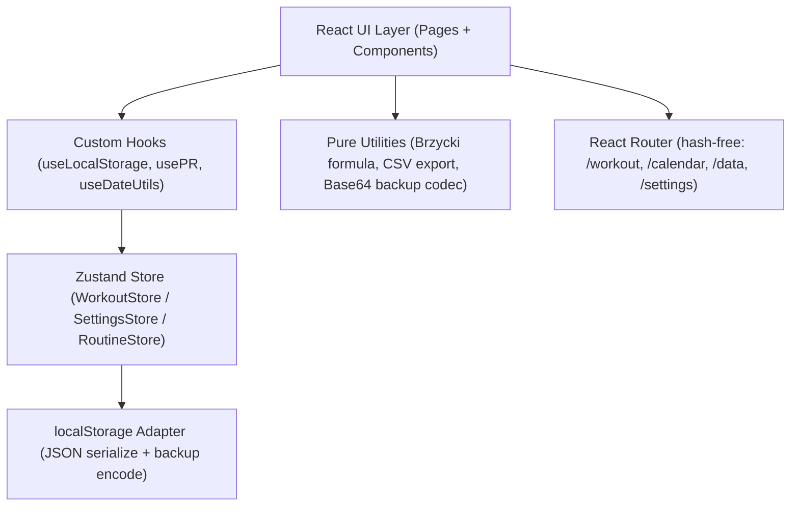
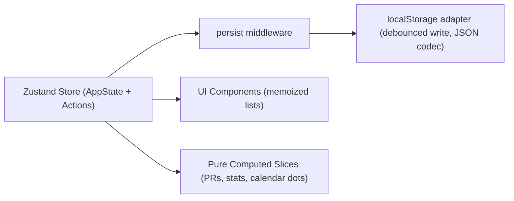
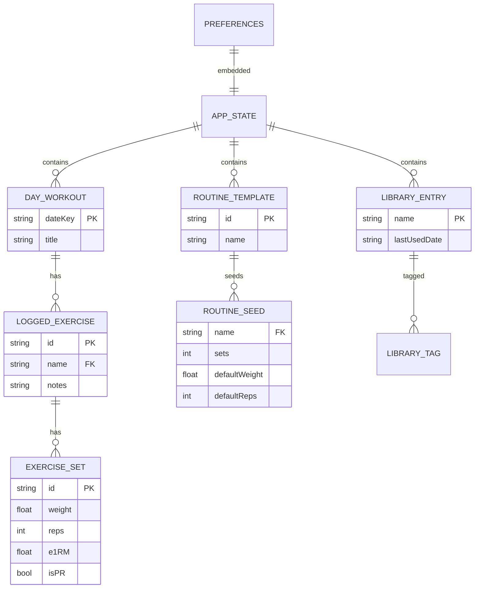

## 1. Architecture Design



No backend — 100% client-side SPA. All state persists through Zustand slices bound to a localStorage adapter that writes on every change (debounced 250ms) and hydrates on initial load with fallback to default routines.

## 2. Technology Description

- **Frontend Framework**: React 18 + TypeScript
- **Build Tool**: Vite 5
- **Styling**: Tailwind CSS 3 (custom Liquid Glass theme tokens in `tailwind.config.js`)
- **Routing**: react-router-dom v6 (client-side, 4 tabs: Workout / Calendar / Data / Settings)
- **State Management**: zustand — three slices bound via a single store, with `persist` middleware pointing to a custom localStorage engine that also supports import/export.
- **Icons**: lucide-react (per project guidelines; no raw SVG or PNG icons)
- **Persistence**: browser `localStorage` with JSON serialization; backup codes = base64(JSON.stringify(fullState)) with checksum header.
- **Backend**: None — pure SPA; no API calls.
- **Database**: localStorage as sole persistence layer.

## 3. Route Definitions

| Route | Page | Purpose |
|-------|------|---------|
| `/` or `/workout` | `WorkoutPage` | Default landing; today's session with date navigation, exercise cards, set rows, PR signals |
| `/calendar` | `CalendarPage` | Interactive month grid + weekly review + selective copy/paste modal |
| `/data` | `MyDataPage` | Personal records gallery, quick stats, search/sort by name/tag |
| `/settings` | `SettingsPage` | Preferences, exercise library manager, routine templates, CSV export, backup/restore |

## 4. API Definitions

No backend APIs. All data access goes through typed zustand actions.

```ts
// --- Core Types (shared between UI & store) ---
export interface ExerciseSet {
  id: string;
  weight: number;       // kg
  reps: number;
  isPR?: boolean;
  e1RM?: number;        // Brzycki result (computed)
}
export interface LoggedExercise {
  id: string;
  name: string;
  tags: string[];
  sets: ExerciseSet[];
  notes?: string;
}
export interface DayWorkout {
  dateKey: string;      // YYYY-MM-DD
  title?: string;
  exercises: LoggedExercise[];
}
export interface RoutineExerciseSeed {
  name: string;
  sets: number;
  defaultWeight?: number;
  defaultReps?: number;
  tags?: string[];
}
export interface RoutineTemplate {
  id: string;
  name: string;
  exercises: RoutineExerciseSeed[];
}
export interface ExerciseLibraryEntry {
  name: string;        // primary key (case-insensitive)
  tags: string[];
  lastUsed?: { sets: ExerciseSet[]; dateKey: string; };
}
export interface Preferences {
  weightIncrement: 0.5 | 1 | 2.5;
  weekStartsOn: 0 | 1; // 0 = Sunday, 1 = Monday
}
export interface AppState {
  workouts: Record<string, DayWorkout>;   // key = dateKey
  routines: RoutineTemplate[];
  library: Record<string, ExerciseLibraryEntry>;
  prefs: Preferences;
}
```

Store actions (typed, zustand):

```ts
interface WorkoutStoreActions {
  setActiveDate: (d: string) => void;
  addExercise: (dateKey: string, name: string, fromLibrary?: boolean) => void;
  removeExercise: (dateKey: string, exId: string) => void;
  addSet: (dateKey: string, exId: string) => void;
  updateSet: (dateKey: string, exId: string, setId: string, patch: Partial<ExerciseSet>) => void;
  removeSet: (dateKey: string, exId: string, setId: string) => void;
  setExerciseTags: (dateKey: string, exId: string, tags: string[]) => void;
  setExerciseNotes: (dateKey: string, exId: string, notes: string) => void;
  applyRoutine: (dateKey: string, routineId: string) => void;
  copyExercises: (fromDate: string, toDate: string, exerciseIds: string[]) => void;
  setPrefs: (p: Partial<Preferences>) => void;
  // Library
  addLibraryExercise: (name: string, tags?: string[]) => void;
  renameLibraryExercise: (oldName: string, newName: string) => void; // updates logs globally
  removeLibraryExercise: (name: string) => void;
  setLibraryTags: (name: string, tags: string[]) => void;
  // Routines
  addRoutine: (name: string, exs: RoutineExerciseSeed[]) => void;
  updateRoutine: (id: string, patch: Partial<RoutineTemplate>) => void;
  removeRoutine: (id: string) => void;
  resetRoutinesToDefaults: () => void;
  // Data ops
  exportCSV: (start: string, end: string) => Blob;
  encodeBackup: () => string;
  decodeBackup: (code: string) => AppState | null;  // validates checksum
  restoreBackup: (state: AppState) => void;
}
```

## 5. Server Architecture Diagram

No backend/server. State layer only:



## 6. Data Model

### 6.1 Data Model Definition



### 6.2 Initial Data (Default Routines — loaded once on first hydration)

Seeded in a `src/utils/defaults.ts` constant and inserted by the zustand `onRehydrateStorage` / first-time-init logic if `state.routines.length === 0`:

1. **PUSH**: Press Inc. Máquina (3), Press Plano Manc. (3), Cruces en Polea (2), Triceps tras nuca (3), Pushdown Cuerda (2)
2. **PULL**: Jalón Neutro (3), Remo apoyo pecho (3), Pullover Polea (2), Curl Inclinado (3), Curl Martillo (2)
3. **LOWER**: RDL Rumano (3), Prensa -Pies altos- (3), Curl Femoral Sent. (3), Ext. Cuadriceps (2), Gemelo Prensa (4)
4. **UPPER**: Press Convergente (3), Remo Polea Ancho (3), Elev. Laterales (4), Bayesian Curl (2), Ext. Cross-body (2)
5. **FULL BODY**: Press Plano Máq. (3), Jalón Neutro Ancho (3), Prensa -Pies sep.- (3), RDL Mancuernas (2), Elev. Polea Tras. (3), Bayesian Curl (2), Press Francés M. (2)

Defaults for brand-new sets: `{ weight: 30, reps: 12 }`.

### 6.3 Pure Utility Contracts

```ts
// src/utils/pr.ts
export function brzycki(weight: number, reps: number): number;
// Returns e1RM, rounded to 1 decimal; guards: weight<=0 → 0, reps<=0 → 0, reps>=35 → clamp(weight * 1.03)

export function comparePR(newS: { weight: number; reps: number }, prevBest: { weight: number; reps: number } | null): boolean;
// True if brzycki(newS) > brzycki(prevBest) OR (prevBest === null and both weight/reps > 0)

export function computeAllPRs(workouts: Record<string, DayWorkout>): Record<string, { weight: number; reps: number; e1RM: number; dateKey: string; tags: string[] }>;
// Returns per-exercise best by e1RM across all history; feeds My Data tab + inline PR signals

// src/utils/storage.ts
export function encodeBackup(state: AppState): string;     // base64(sha1 prefix + json)
export function decodeBackup(code: string): AppState | null;

// src/utils/csv.ts
export function workoutsToCSV(workouts: Record<string, DayWorkout>, start: string, end: string): string;
// Columns: Date,Exercise,Set#,Weight(kg),Reps,e1RM,Tags,Notes
```
